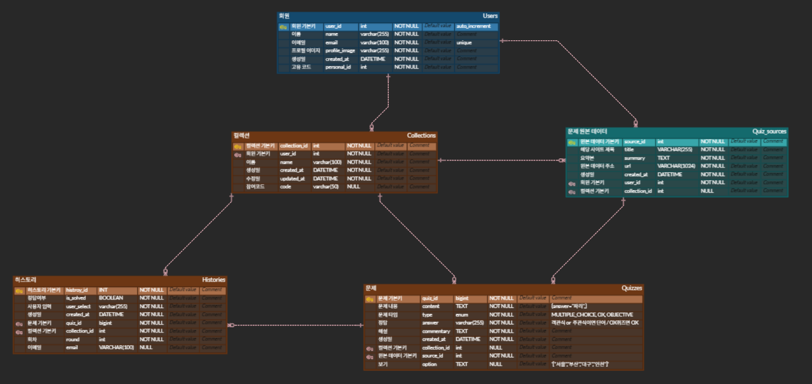

#  

##  읽는 것에서 기억하는 것으로, Memozy
방대한 정보를 요약하고, 문제로 풀며 지식을 효과적으로 학습하고 정리하는 플랫폼.

### 🧭 서비스 목적
---
🧠 **누구나 쉽게, 부담 없이 지식 학습**  
> GPT, 블로그, 위키백과 등 다양한 출처의 글을 자동으로 요약해, 복잡한 정보도 쉽게 이해할 수 있도록 도와줍니다.

📚 **수천 건의 콘텐츠 기반 지식 탐색**  
> 다양한 출처의 글과 문제를 컬렉션으로 정리하여, 원하는 주제의 콘텐츠를 자유롭게 탐색할 수 있습니다.

📝 **문제 풀이로 지식 정리와 복습까지**  
> 요약된 내용을 바탕으로 생성된 문제를 직접 풀며 학습 내용을 정리하고, 혼자 또는 다른 사람과 함께 반복 학습할 수 있습니다.

📊 **문제 풀이 기록과 학습 리포트 제공**  
> 푼 문제 수, 정답률, 학습 주제 분포, 오답노트까지 한눈에 확인할 수 있는 리포트를 통해 학습 현황을 정리하고 성장 과정을 시각화합니다.

## 🔔 SSAFY 12기 자율 PJT

📍 **자율 프로젝트**

2025.04.14 ~ 2025.05.22 (7주)

## 🎬 서비스 영상

👉🏻[Memozy](https://www.youtube.com/watch?v=JatCCZYCbwI)

## ✨ 주요 기능

### 🏛️ 1. AI 요약 & 문제 생성 일지
> 크롬 익스텐션을 통해 GPT, 블로그, 위키백과, 노션등에서 글과 이미지를 추출한 후, 요약해줍니다.

  

 

> 핵심 내용을 바탕으로 AI가 자동으로 문제를 생성해줍니다.

  

### ✍️ 2. 지식 컬렉션 정리 & 분류
> 생성된 문제들을 주제별 컬렉션으로 정리하고, 주제별 흐름을 쉽게 따라갈 수 있는 형태로 제공합니다.

  

 

### 🔎 3. 개인 및 단체 퀴즈 쇼
> 컬렉션 단위로 문제를 풀며 나만의 속도로 학습하고 복습할 수 있습니다.

  

 

> 여러 명이 함께 실시간으로 참여해 문제를 풀고 결과를 비교하는 활동도 가능합니다.

  

### 🎨 4. 히스토리
> 개인 및 단체 퀴즈 쇼를 통해 푼 문제 수, 정답률, 학습 주제 분포, 오답 노트 등 다양한 지표가 담긴 시각화된 학습 리포트를 제공합니다.

> 자신의 학습 현황을 한눈에 파악하고, 성장 과정을 체계적으로 관리할 수 있습니다. 

  

 

## 🌐 사이트

🔗 [Memozy](https://memozy.site/)
 

🧩 [Memozy (Chrome 확장)](https://chromewebstore.google.com/detail/memozy/edkigpibifokljeefiomnfadenbfcchj?hl=ko)

## 🧪 테스트 계정
ID: memozyTest1@gmail.com    
PWD: memozy1!

---

## ⚙️ 기술 스택

<table>
    <thead>
        <tr>
            <th>분류</th>
            <th>기술 스택</th>
        </tr>
    </thead>
    <tbody>
        <tr>
            <td>
                  
프론트엔드

            </td>
            <td>
               

            </td>
        </tr>
        <tr>
            <td>
                
백엔드

            </td>
            <td>
                
                
            </td>
        </tr>
        <tr>
            <td>
                
데이터 베이스

            </td>
            <td>

            </td>
        </tr>
        <tr>
            <td>
                
로그 수집

            </td>
            <td>
            
            
             
            </td>
        </tr>
                <tr>
            <td>
                
모니터링

            </td>
            <td>

            </td>
        </tr>
        <tr>
            <td>
                
인프라/배포

            </td>
            <td>
               

            </td>
        </tr>
    </tbody>
</table>

 

## 📜 산출물
### 📌 Architecture Diagram

### 📌 ERD

  

### 📌 User Flow

  

## 🧡 팀원 소개

<table>
  <tr>
    <th scope="col" colspan="3">Backend</th>
    <th scope="col" colspan="3">Frontend</th>
  </tr>
  <tr>
    <td>김진영(팀장)</td>
    <td>이경훈</td>
    <td>이학준</td>
    <td>민경현</td>
    <td>박태현</td>
    <td>이가희</td>
  </tr>
  <tr>
    <td>
      
    </td>
    <td>
      
    </td>
    <td>
       
    </td>
    <td>
      
    </td>
    <td>
      
    </td>
    <td>
      
    </td> 
  </tr>
  <tr>
    <td><a href="https://github.com/jyoooooung">github.com/jyoooooung</a></td>
    <td><a href="https://github.com/TinyFrogs">github.com/TinyFrogs</a></td>
    <td><a href="https://github.com/lhj4499">github.com/lhj4499</a></td>
    <td><a href="https://github.com/Owhen-Min">github.com/Owhen-Min</a></td>
    <td><a href="https://github.com/manimani10002">github.com/manimani10002</a></td>
    <td><a href="https://github.com/2gahee">github.com/2gahee</a></td>
  </tr>
</table>

---
### 🖥️ 백엔드

### 김진영 - 실시간 퀴즈쇼 기능 구현

* **WebSocket + STOMP 기반 실시간 통신 구조 구축**

  * WebSocket을 활용한 양방향 메시지 처리로 퀴즈쇼 실시간 진행
  * STOMP 프로토콜 도입 → 메시지 발행/구독 분리로 구조적 처리
* **세션 및 인증 처리**

  * `ChannelInterceptor`를 통해 사용자 인증 및 권한 검증 로직 구현
* **안정성 확보**

  * WebSocket 에러 핸들러 구성 → 예외 발생 시 안정적 연결 유지 및 대응

### 이경훈 - 인프라 및 MLOps 구축

* **인증 및 보안**

  * Spring Security + OAuth2.0으로 Google 로그인 연동
* **CI/CD 및 배포 자동화**

  * Jenkins + SonarQube 기반 Frontend/Backend CI/CD 파이프라인 구축
  * Blue-Green 배포 전략 도입 → 서비스 무중단 배포 구현
* **모니터링 및 로그 분석**

  * ELK Stack으로 Nginx 및 Spring Boot 로그 수집/분석
  * Prometheus + Grafana 기반 메트릭 모니터링 및 알람 설정
* **AI 기능 구현**

  * GPT-4o 기반 LLM을 활용하여 텍스트 요약 및 퀴즈 자동 생성 기능 구현

### 이학준 - 퀴즈 데이터 관리 및 컬렉션 관리

* **Redis 기반 퀴즈 생성 및 상태 관리 시스템 구축**

  * Redis를 활용해 실시간 퀴즈 데이터 생성, 참가자 응답 기록, 정답 여부 저장 등 퀴즈 흐름 관리

* **QueryDSL을 활용한 퀴즈 도메인 관리 및 복합 조회 구현**

  * 퀴즈, 컬렉션, 사용자 기록 등 복합 관계 데이터를 QueryDSL로 효율적 조회
  * 동적 조건 및 집계 쿼리를 적용하여 통계성 정보 처리 최적화

 

### 🖥️ 프론트엔드
### 박태현 - 프론트엔드 개발

* **FSD 디자인 패턴 기반 개발환경 구축**

  * `pages`, `features`, `components`로 관심사 분리
  * 기능 단위 독립성 보장 → 유지보수성과 확장성 향상
* **프론트엔드 스택 구성**

  * React + TypeScript + Vite로 최신 개발환경 구성
  * Tailwind CSS로 세부적인 디자인 시스템 구축
* **상태 관리**

  * Zustand: 전역 상태 관리
  * useState: 컴포넌트 로컬 상태 관리
* **라우팅**

  * React Router + useLocation / useParams: 동적 라우팅
  * Link, Outlet을 활용한 중첩 라우팅
* **API 통신 구조화**

  * Axios 기반 API 요청 처리
  * 인터셉터를 통한 토큰 관리 및 에러 핸들링
* **애니메이션 처리**

  * Framer Motion을 이용한 부드러운 UI 전환

### 민경현 - 크롬 익스텐션 개발 및 실시간 통신

* **모듈 구조화**

  * Webpack 기반 4개 모듈(popup, content, background, history)로 분리
* **데이터 저장 및 동기화**

  * `chrome.storage` API로 모듈 간 상태 동기화
* **콘텐츠 파싱 고도화**

  * `web-content-extractor`, `mozilla readability` 기반 핵심 콘텐츠 추출
  * Turndown 커스터마이징 → HTML → Markdown 변환
* **아키텍처 설계**

  * MVC 패턴 도입으로 관심사 분리 및 재사용성 강화
* **에러 핸들링**

  * Context + Zustand를 통한 전역 예외 처리
  * 예외 발생 시 모달 UI로 사용자 피드백 제공
* **WebSocket 통신**

  * stomp.js 기반 서버 실시간 연결
  * 다중 채널 구독 + 핸들러 모듈화로 통신 효율성 확보
  * Zustand + persist로 클라이언트 상태 유지

* **협업 환경 구성**

  * Prettier 도입으로 코드 스타일 일관화
  * 프론트 리드로서 코드 리뷰 및 구조 가이드 주도

### 이가희 - 데이터 시각화 및 상태 관리

* **FSD 디자인 패턴 기반 개발환경 구축**

  * `pages`, `features`, `components` 분리로 관심사 분리
  * 구조화된 개발환경 구축으로 확장성 확보
* **UI 및 접근 제어**

  * Tailwind CSS 기반 반응형 UI 구성
  * ProtectedRoute 적용으로 인증 기반 접근 제어
* **상태 관리 및 API 구조화**

  * Zustand 기반 전역 상태 관리
  * API 클라이언트 모듈 구성으로 요청 일원화
* **데이터 시각화**

  * Chart.js + react-calendar-heatmap 사용
  * 막대 차트, 파이 차트, 히트맵 등 3종 시각화 구현
  * 시각화 목적에 맞춘 데이터 구조 최적화
* **라우팅**

  * React Router + useLocation / useParams: 동적 라우팅
  * Link, Outlet을 활용한 중첩 라우팅
* **애니메이션 처리**

  * Framer Motion을 이용한 부드러운 UI 전환

 

