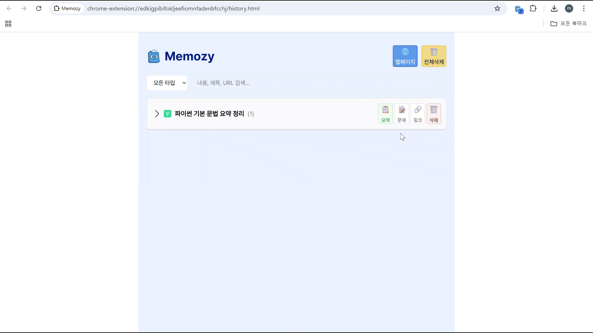
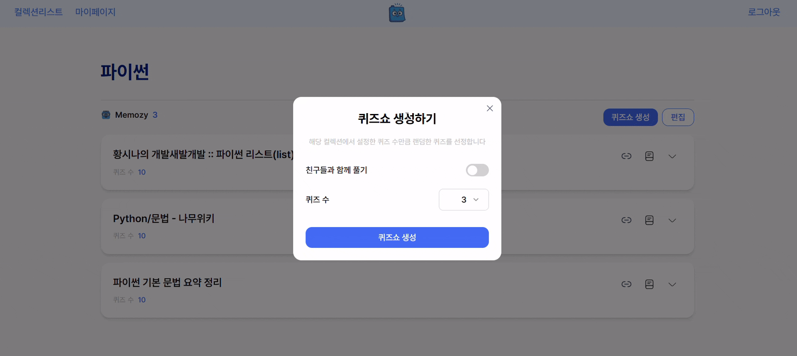
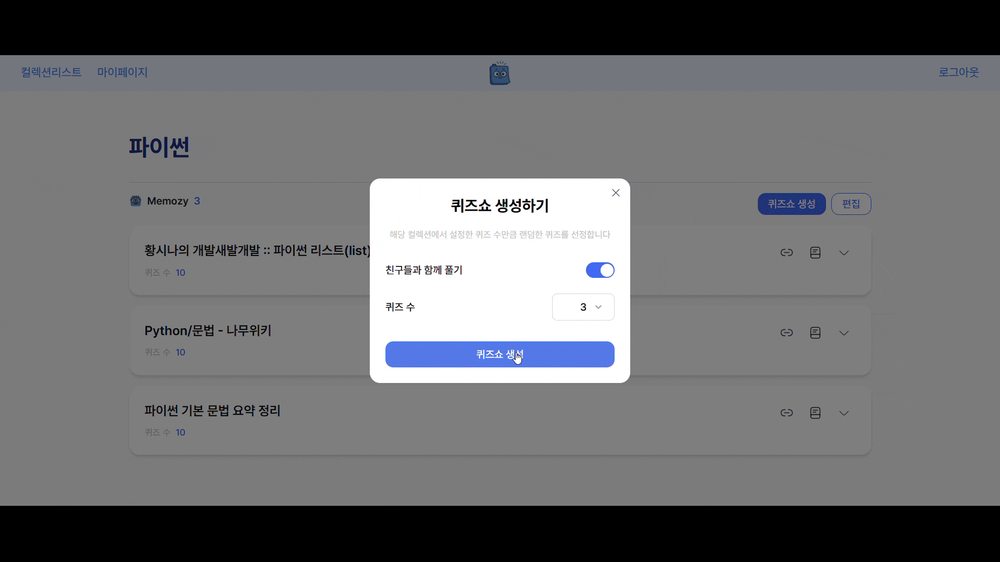
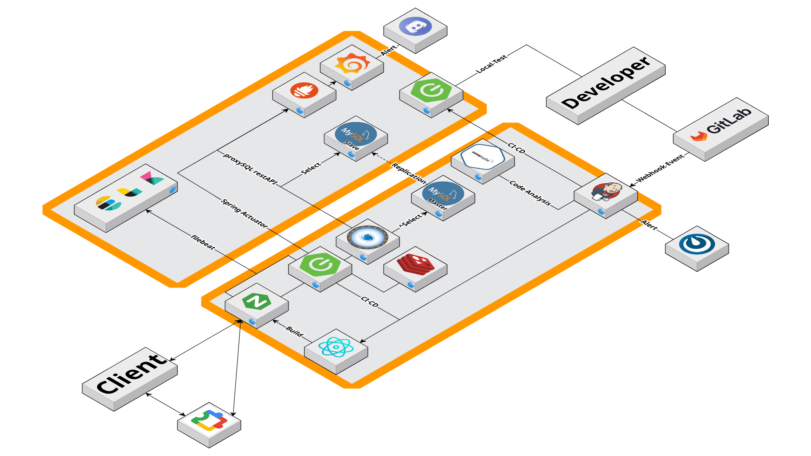
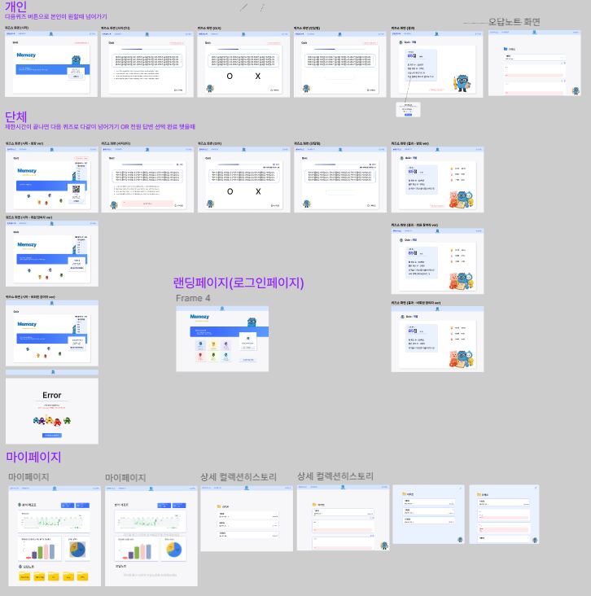

#  

##  읽는 것에서 기억하는 것으로, Memozy
방대한 정보를 요약하고, 문제로 풀며 지식을 효과적으로 학습하고 정리하는 플랫폼.

### 🧭 서비스 목적
---
🧠 **누구나 쉽게, 부담 없이 지식 학습**  
> GPT, 블로그, 위키백과 등 다양한 출처의 글을 자동으로 요약해, 복잡한 정보도 쉽게 이해할 수 있도록 도와줍니다.

📚 **수천 건의 콘텐츠 기반 지식 탐색**  
> 다양한 출처의 글과 문제를 컬렉션으로 정리하여, 원하는 주제의 콘텐츠를 자유롭게 탐색할 수 있습니다.

📝 **문제 풀이로 지식 정리와 복습까지**  
> 요약된 내용을 바탕으로 생성된 문제를 직접 풀며 학습 내용을 정리하고, 혼자 또는 다른 사람과 함께 반복 학습할 수 있습니다.

📊 **문제 풀이 기록과 학습 리포트 제공**  
> 푼 문제 수, 정답률, 학습 주제 분포, 오답노트까지 한눈에 확인할 수 있는 리포트를 통해 학습 현황을 정리하고 성장 과정을 시각화합니다.

## 🔔 SSAFY 12기 자율율 PJT

📍 **자율 프로젝트**

2025.04.14 ~ 2025.05.22 (7주)

## 🎬 서비스 영상

👉🏻[Memozy](https://youtu.be/VFEmw9XV95g)

## ✨ 주요 기능

### 🏛️ 1. AI 요약 & 문제 생성 일지
> 크롬 익스텐션을 통해 GPT, 블로그, 위키백과, 노션등에서 글과 이미지를 추출한 후, 요약해줍니다.

  

 

> 핵심 내용을 바탕으로 AI가 자동으로 문제를 생성해줍니다.

  

### ✍️ 2. 지식 컬렉션 정리 & 분류
> 생성된 문제들을 주제별 컬렉션으로 정리하고, 주제별 흐름을 쉽게 따라갈 수 있는 형태로 제공합니다.

  

 

### 🔎 3. 개인 및 단체 퀴즈 쇼
> 컬렉션 단위로 문제를 풀며 나만의 속도로 학습하고 복습할 수 있습니다.

  

 

> 여러 명이 함께 실시간으로 참여해 문제를 풀고 결과를 비교하는 활동도 가능합니다.

  

### 🎨 4. 히스토리
> 개인 및 단체 퀴즈 쇼를 통해 푼 문제 수, 정답률, 학습 주제 분포, 오답 노트 등 다양한 지표가 담긴 시각화된 학습 리포트를 제공합니다.

> 자신의 학습 현황을 한눈에 파악하고, 성장 과정을 체계적으로 관리할 수 있습니다. 

  

 

## 🌐 사이트

🔗 [Memozy](https://memozy.site/)

## 🧪 테스트 계정
ID: memozyTest1@gmail.com    
PWD: memozy1!

---

## ⚙️ 기술 스택

<table>
    <thead>
        <tr>
            <th>분류</th>
            <th>기술 스택</th>
        </tr>
    </thead>
    <tbody>
        <tr>
            <td>
                  
프론트엔드

            </td>
            <td>
               

            </td>
        </tr>
        <tr>
            <td>
                
백엔드

            </td>
            <td>
                
                
            </td>
        </tr>
        <tr>
            <td>
                
데이터 베이스

            </td>
            <td>

            </td>
        </tr>
                <tr>
            <td>
                
로그 수집

            </td>
            <td>
            
            
             
            </td>
        </tr>
        <tr>
            <td>
                
인프라/배포

            </td>
            <td>
               

            </td>
        </tr>
    </tbody>
</table>

 

## 📜 산출물
### 📌 Architecture Diagram

### 📌 ERD

  

### 📌 User Flow

  

## 🧡 팀원 소개

<table>
    <tr>
      <th scope="col" colspan="3"> Backend </th>
      <th scope="col" colspan="3"> Frontend </th>
    </tr>
    <tr>
      <td>김진영</td>
      <td>이경훈</td>
      <td>이학준</td>
      <td>민경현</td>
      <td>박태현</td>
      <td>이가희</td>
    </tr>
    <tr>
      <td>
        
      </td>
      <td>
        
      </td>
      <td>
          
      </td>
      <td>
        
      </td>
      <td>
        
      </td>
      <td>
        
      </td> 
    </tr>
</table>

 

| Contributors | Role                   | Position |
|--------------|------------------------|----------|
| **김진영**     | 팀장,   Backend   | - ****   - ****   - ****   - **** |
| **이경훈**   | 팀원,   Backend   | - ****   - ****   - ****   - **** |
| **이학준**   | 팀원,   Backend   | - ****   - ****   - ****   - **** |
| **민경현**   | 팀원,   Frontend  | - ****   - ****   - ****   - **** |
| **박태현**   | 팀원,   Frontend  | - ****   - ****   - ****   - **** |
| **이가희**   | 팀원,   Frontend  | - ****   - ****   - ****   - **** |

